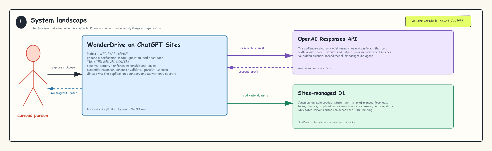
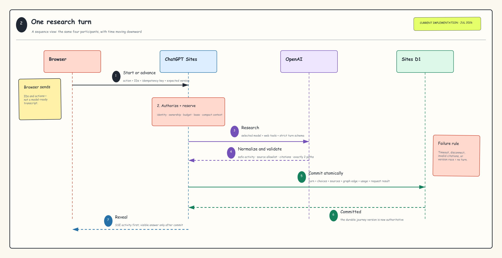
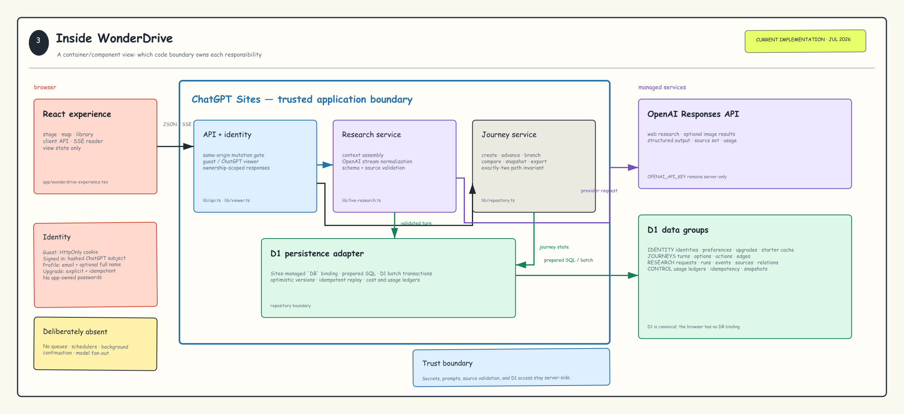
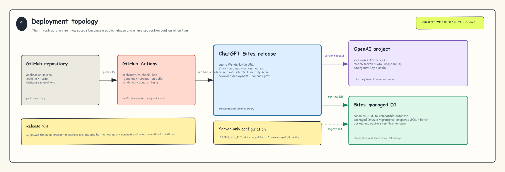

# WonderDrive

WonderDrive is an audience-directed curiosity performance. A visitor chooses a performer and a question, watches the research stage, receives a sourced explanation, and chooses between exactly two earned ways forward.

This repository is the public implementation for the 2026 OpenAI Build Week hackathon. It implements the **V3 research-first blueprint**. A judge can use GPT-5.6 Luna with built-in web search for a real foreground research turn, inspect its sources and usage, direct or reopen either path, save snapshots, export and compare journeys, tune audience settings, or switch to a free deterministic demo.

**Live V3 site:** [wonderdrive.jigs.chatgpt.site](https://wonderdrive.jigs.chatgpt.site)

## Product contract

- One selected performer carries the journey; the audience may choose a different model between turns, and the live adapter never silently delegates to another model.
- Research activity and sources are observable; hidden chain-of-thought is not exposed.
- Every ready turn ends with exactly two distinct next questions.
- The journey advances only after an explicit audience action.
- Saved journeys form a branchable graph, not a chat transcript.
- Comparison reads previously saved journeys and never launches hidden parallel work.
- Provider failure or disconnect commits no partial turn; the fixture mode is an explicit user choice, never a silent fallback.
- Daily project and per-identity cost ceilings stop new live work before a provider call.
- Guest-to-account transfer is a deliberate, idempotent action rather than a side effect of sign-in.

## Stack

- OpenAI Sites-compatible Vinext application
- React 19, Next-compatible App Router, TypeScript, and Tailwind CSS
- Sites server routes for API work and provider secrets
- Cloudflare D1 through the Sites-managed `DB` binding
- Drizzle schema and generated SQL migrations
- Dispatch-owned Sign in with ChatGPT seam for durable identity
- GitHub Actions for lint, build, and rendered-output tests

## Architecture

The checked-in implementation runs as one public ChatGPT Site. The browser talks only to Sites routes; those routes own identity, authorization, foreground research orchestration, validation, and persistence. Live provider work goes directly to the OpenAI Responses API, while Sites-managed D1 is the canonical product database. There is no queue, scheduler, background continuation, provider fan-out, R2 bucket, Supabase project, or separately operated backend in the current deployment.



The editable source is [the system-landscape Excalidraw board](design/wonderdrive-architecture-01-system-landscape.excalidraw). The complete implementation views are documented in [the architecture decisions](docs/architecture.md#architecture-views).

<details>
<summary>One foreground research turn</summary>



</details>

<details>
<summary>Inside the WonderDrive application boundary</summary>



</details>

<details>
<summary>Build and deployment topology</summary>



</details>

## Local development

Requirements: Node.js `22.13.0` or newer.

```bash
npm ci
cp .env.example .env.local
npm run dev
```

The local site runs at `http://localhost:3000`. Set `OPENAI_API_KEY` in `.env.local` to exercise live mode locally; build tests require no provider request. `WONDERDRIVE_DAILY_BUDGET_USD` optionally changes the default $25 rolling project ceiling. Never expose either value through a `NEXT_PUBLIC_` variable.

Apply all SQL files in `drizzle/` to a fresh local D1 database before exercising the API. Sites applies the packaged migrations when a version is deployed.

## Validation

```bash
npm run architecture:check
npm run lint
npm run typecheck
npm test
npm run db:generate
```

`npm test` performs a production Sites build, verifies the public page and health endpoint, checks fixture invariants, and tests live-source normalization plus citation allowlisting without spending provider usage.

## Repository map

```text
app/                  Product experience, identity helper, and server routes
db/                   Canonical D1 schema
drizzle/              Generated, reviewed SQL migrations
lib/                  Contracts, domain boundaries, providers, fixtures, and D1 repositories
scripts/              Architecture-index maintenance tooling
docs/                 Blueprint, architecture, generated code index, and phase gates
tests/                Rendered production and fixture checks
.openai/hosting.json  Logical Sites-managed bindings
```

## Documentation

- [Phase 0 acceptance gates](docs/phase-0.md)
- [Phase 1 implementation contract](docs/phase-1.md)
- [Phase 2 live research contract](docs/phase-2.md)
- [V3 implementation contract](docs/v3-implementation.md)
- [Final architecture decisions](docs/architecture.md)
- [Current architecture views](docs/architecture.md#architecture-views)
- [Current code index](docs/code-index.md)
- [Final product and engineering blueprint](docs/WonderDrive_Final_Product_and_Engineering_Blueprint_v3_Research_First.docx)

## Status and scope

Every turn starts one foreground Responses stream with the audience-selected, compatible OpenAI model, built-in text search, and optional image results. A bounded citation-repair or evidence-recovery call may follow when the initial draft does not satisfy the source contract. The model can be changed before any later turn without rewriting earlier turn metadata. Presets cap tool calls, output tokens, reasoning effort, and wall time; guest and signed-in identities also have rolling live-run and estimated-spend limits. Consulted URLs, cited relations, sourced image results, provider request IDs, complete usage, price snapshots, prompt/performer/model versions, research handoffs, and all provider-call analytics are persisted in D1.

Automatic journeys, scheduled/background continuation, Trigger.dev, provider fan-out, and live parallel comparison are outside the hackathon scope.

## Contributing and security

See [CONTRIBUTING.md](CONTRIBUTING.md) before opening a pull request. Please report vulnerabilities through the process in [SECURITY.md](SECURITY.md), not a public issue.

## License

No open-source license has been selected yet. Until one is added, copyright law reserves all rights to the project owner.
