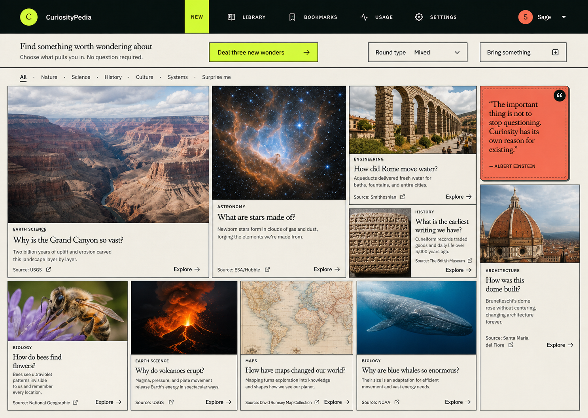

# CuriosityPedia curiosity-learning North Star

> **Status:** Product vision and development authority for the curiosity-learning layer.
> **Date:** July 18, 2026.
> **Product name:** CuriosityPedia, approved by the owner on July 18, 2026.
> **Primary readers:** Product owner, designer, researcher, engineer, content editor, and anyone producing conceptual UX for this product.

## 1. Purpose and authority

This document defines the intended product before implementation details constrain it. It describes the user experience, learning behavior, information model, visual structure, game loop, and development sequence in enough detail to guide product decisions and conceptual UX generation.

This document does not authorize an immediate rewrite of the current application. The existing product remains the behavioral baseline until a scoped implementation changes a specific part of it. Security, privacy, cost, account, deletion, licensing, accessibility, and paid-product readiness remain mandatory constraints.

When another document conflicts with this vision:

- Existing production behavior remains true until code changes.
- This document controls the intended curiosity-learning experience.
- `docs/architecture.md` controls the current technical architecture.
- A future implementation specification must identify every intentional departure from this document.

Normative language in this document is deliberate:

- **Must** means the behavior is required for the product to preserve this vision.
- **Should** means the behavior is expected unless testing produces a documented reason to change it.
- **May** means the behavior is optional.

### How to use this document

- Read Sections 2–8 for the product promise, preserved behavior, domain language, and invariants.
- Read Sections 9–17 for the complete interaction model and spatial UX.
- Read Sections 18–25 for learning behavior, reflection, rewards, personalization, safety, accessibility, recovery, and evaluation.
- Read Sections 26–27 before designing storage or implementation phases.
- Use Sections 28–29 as the direct brief and evaluation rubric for conceptual UX generation.
- Resolve the applicable item in Section 30 before implementing behavior that depends on an open decision.
- Use Section 31 during product, design, and engineering review.

## 2. Product definition

CuriosityPedia is an image-rich, source-backed encyclopedia game that helps a person discover what attracts their attention, understand it through researched visual knowledge, examine their own response through guided inquiry, and choose the next direction from thoughts they produced themselves.

The product has three simultaneous identities:

1. **At the session level, it is an encyclopedia.** Each Knowledge Session is a composed, factual, visual explanation of one concept.
2. **At the path level, it is a journey.** Each choice preserves why one session led to the next.
3. **At the lifetime level, it is a personal knowledge graph.** Repeated concepts, different arrivals, questions, notes, lenses, and unexplored directions become a durable representation of how the user thinks and learns.

The shortest accurate product promise is:

> **See something worth understanding. Look closely. Think with it. Follow what becomes interesting. Keep the map.**

## 3. The product soul

CuriosityPedia must feel like an elegant illustrated reference book, a museum collection, a private field notebook, and a branching game occupying one coherent world.

The product must not feel like:

- a chatbot transcript;
- a school assignment;
- a personality test;
- a quiz funnel;
- an infinite-content feed;
- a generic AI wrapper;
- a dashboard that reduces thought to scores;
- an autonomous course choosing a curriculum for the user;
- therapy, diagnosis, or clinical cognitive treatment.

CuriosityPedia does not manufacture curiosity with exaggerated copy. It creates the conditions for curiosity by presenting concrete material, preserving uncertainty long enough for the learner to notice it, and asking questions that make their thinking visible.

The user is never required to arrive with a well-formed question. CuriosityPedia accepts responsibility for warming up attention and initiating play.

## 4. What remains from the current product

The curiosity-learning layer is additive. It must preserve the strongest parts of the current product:

- researched answers with source-backed claims;
- real-world visual evidence separated from decorative art;
- editorial rather than chat-like presentation;
- performer cues that affect explanatory emphasis without becoming rigid characters;
- model, cost, source, and research transparency;
- persistent journeys and revisitable branches;
- the Stage as the focused place for the current subject;
- a map that preserves route, ancestry, open directions, and current location;
- library, bookmarks, snapshots, export, preferences, usage controls, localization, and reduced-motion support;
- no hidden continuation: research begins only after a visible user action.

The primary interaction being replaced is the default choice between exactly two AI-generated follow-up questions. The new default is a Curiosity Session that produces learner-owned notes and candidate threads. The existing two-question mechanism may remain temporarily for legacy sessions and as an explicit fallback when the user asks for help, but it must not remain the intellectual center of the future experience.

## 5. North Star behavior

After meaningful use, a user should be able to say:

- I did not need to know what to ask before I began.
- I saw several strong images that made the subject concrete.
- I could move between images, explanations, and my notes without losing my place.
- CuriosityPedia asked questions that responded to what I actually noticed.
- My next direction came from my reactions and thoughts, not from two unrelated buttons.
- When I returned to a concept, CuriosityPedia created a fresh session shaped by how I arrived this time.
- I could reopen the exact images, information, questions, and notes from every earlier visit.
- I could compare how I approached the same concept from different directions.
- The map showed what I explored, how I reached it, and which directions remain open for me.
- The game rewarded sustained exploration without pretending to measure my intelligence or worth.

## 6. Non-goals

The product is not trying to:

- prove that one person is more curious than another;
- guarantee complete coverage of a concept;
- rank questions with a universal quality score;
- force every user through every inquiry lens;
- replace books, teachers, museums, primary sources, field experience, or human conversation;
- infer private psychological states from ordinary product behavior;
- optimize time on site, API consumption, note length, or question count;
- promise that every regenerated session contains entirely unique facts or images;
- merge every similar topic into one canonical concept without user correction;
- convert all learning into a single tree when repeated concepts create a graph;
- make children disclose personal experiences in order to play.

## 7. Canonical product ontology

The product must use the following concepts consistently.

### 7.1 Concept

A **Concept** is the stable subject that can be encountered more than once. Examples include public memory, Gothic architecture, feedback loops, coral bleaching, compound interest, and ritual.

A Concept is not a generated page. It is the durable identity beneath multiple visits.

The system may propose that two sessions belong to the same Concept. When the match is ambiguous or meaningfully broad, the user must be able to keep them separate or merge them later.

### 7.2 Knowledge Session

A **Knowledge Session** is one immutable, researched, image-rich encounter with a Concept. It records:

- the arrival context;
- the user-approved inquiry or thread;
- the editorial lens;
- answer density and intended session length;
- ordered images and their editorial roles;
- captions, interpretations, sources, and provenance;
- written explanation;
- model, prompt, language, and research time;
- uncertainties and unresolved material;
- the Curiosity Session that followed.

Every committed Jump into a Concept creates a new Knowledge Session. Reaching a known Concept through a selected thread never silently reuses or overwrites an older session. Merely opening a Concept page or inspecting session history is navigation, not a new arrival, and must not start research.

### 7.3 Curiosity Session

A **Curiosity Session** is the guided, note-taking phase after a Knowledge Session. The user revisits the images and information, records observations and reactions, answers adaptive prompts, makes connections, and develops candidate directions.

Curiosity Session is the product term. The interface must not call it an interrogation, assessment, or test.

### 7.4 Note

A **Note** is a user-authored artifact attached to one or more of:

- the whole Knowledge Session;
- an image;
- a selected region of an image;
- a passage of text;
- a source;
- another Note;
- a prior Concept or session.

A Note may carry an optional user-facing stem: **I notice**, **I think**, **I feel**, **I am confused by**, **I wonder**, or **This connects to**. These are invitations, not required categories.

### 7.5 Lens

A **Lens** is a reusable cognitive operation, such as observing, comparing, examining evidence, changing perspective, tracing cause, testing a boundary, changing scale, or considering consequences.

A Lens is not a topic and not a difficulty level.

### 7.6 Curiosity thread

A **Curiosity thread** is a possible direction synthesized from the user's Notes and explicit responses. It must preserve the user's language and identify the observations that produced it.

A thread is not yet a Jump. It remains provisional until the user selects it.

### 7.7 Jump

A **Jump** is the committed relationship between a source session and the next Concept. It records:

- the source Knowledge Session and Curiosity Session;
- the selected thread;
- the learner's wording;
- the source Notes and image regions;
- the Lens or combination of Lenses involved;
- the destination Concept after concept resolution;
- whether the destination was new or previously encountered;
- the time the choice was made.

The Jump explains why the learner moved. A topic label alone does not.

### 7.8 Journey and path

A **Journey** is a bounded play history that begins from one arrival state and grows through Jumps.

A **Path** is one ordered route through the Journey. A Journey may branch when a user returns to an old session or an unchosen thread.

### 7.9 Frontier

A **Frontier** is a saved but unexplored direction produced by a Curiosity Session. A Frontier is personal: it means “not yet explored by this user from this session,” not “unknown” or “missing from human knowledge.”

### 7.10 Session version

A **Session version** is another Knowledge Session for the same Concept. Versions remain separate and immutable. They may differ by arrival, date, question, Lens, images, sources, model, language, session length, and user context.

### 7.11 Personal graph

The **Personal graph** contains Concepts as stable nodes, Knowledge Sessions as visits to those nodes, Jumps as meaningful edges, and Frontiers as open edges. The chronological Journey tree and semantic Concept graph are different projections of the same history.

## 8. Non-negotiable invariants

1. **Concepts persist; sessions do not repeat.** Every committed Jump creates a new Knowledge Session at its destination.
2. **Sessions are immutable.** Refreshing information creates a new version.
3. **The learner chooses before history is revealed.** During brainstorming, the system must not reveal that a candidate thread maps to an old Concept until the user selects it. This reduces anchoring to previous thinking.
4. **A new arrival changes the session.** Research and visual selection must use the source Concept, selected Notes, selected thread, and arrival Lens.
5. **Old work remains actionable.** A user may open an old Curiosity Session, select a previously unchosen Frontier, and create a new branch today.
6. **The same Concept may have many valid connections.** Architecture may connect to power through scale, ownership, labor, access, or symbolism. These Jumps remain distinct.
7. **The system never claims exhaustive coverage.** It describes what this user has and has not explored.
8. **Thinking is not a leaderboard.** Narrative reflection and game currency remain separate.
9. **Images must teach.** Image count never excuses decorative, misleading, repetitive, or weakly sourced material.
10. **No invisible continuation.** Starting a new research session requires a visible user choice.

## 9. The complete play loop

One full round is:

1. **Arrive** — enter through a new encounter, a previous thread, or something from the user's life.
2. **Warm up** — react to concrete material instead of filling an empty question field.
3. **Browse and select an encounter** — scan the image-rich concept grid and choose what pulls attention.
4. **Zoom in** — enter an image-rich Knowledge Session.
5. **Read and look** — move through a visual explanation and inspect sources as desired.
6. **Zoom out** — enter the Curiosity Session with the completed Concept at the center.
7. **Observe and reflect** — answer adaptive questions and create Notes.
8. **Generate possibilities** — develop several Curiosity threads without judging them prematurely.
9. **Select one thread** — commit to the direction that matters now.
10. **Resolve the destination** — determine whether it is a new or known Concept.
11. **Reveal history** — if known, show previous visits only after selection.
12. **Create a new Knowledge Session** — research using the current arrival context.
13. **Preserve alternatives** — retain unselected threads as Frontiers.
14. **Record the win** — update the Journey, graph, notebook, and game state.

The loop repeats without a predetermined end.

## 10. Arrival experience

### 10.0 Approved landing-page direction

> **Owner approval — July 18, 2026:** The owner loved this concept. The dense, image-rich encyclopedia grid is the approved landing-page direction and supersedes all earlier landing concepts.

This image is the visual authority for landing-page implementation. The implementation must preserve its compact navigation, small utility header, category index, dense multi-concept image grid, catalog-like metadata, broad subject mix, and tactile CuriosityPedia design language.

Implementation must refine the approved image in these ways:

- replace the refresh-button copy shown in the mockup with **Show me something new** or an equally compact action that updates the multi-concept grid;
- keep source and institution text visually subordinate to the concept title and teaser;
- keep source links separate from the tile's primary **Explore** action so ordinary exploration never redirects to an external website;
- open external sources in a new browser tab and label that behavior with an external-link icon and accessible name;
- use the smallest practical amount of whitespace, hero copy, and explanatory text while preserving readable type, keyboard focus, touch targets, and scanning clarity;
- devote most above-the-fold space to eye-catching factual images and useful concept choices;
- preserve broad category access, including **All**, **Nature**, **Science**, **History**, **Culture**, **Systems**, and **Surprise me**, with room for additional categories as the catalog grows.

### 10.1 First visit

The first screen must not require a question and must not spend the viewport on a large marketing hero. Recommended compact copy:

> **Find something worth wondering about**
>
> Choose what pulls you in. No question required.

The dominant surface is the dense multi-concept encyclopedia grid. Each visible Concept entry must include:

- an eye-catching factual image or other licensed preview media;
- a concise category label;
- a short question or title;
- one brief factual teaser;
- a compact source or institution label;
- a clear **Explore** action.

Compact utility actions may include:

- **Show me something new**
- **Round type**
- **Bring something with me**

The initial viewport should show many materially different Concepts at once. The grid should balance natural history, science, history, culture, systems, maps, engineering, architecture, and other fields without presenting academic categories as the primary content.

### 10.2 Returning visit

Recommended copy:

> **Welcome back. Ready for another round?**

Actions:

- **Continue my last thread**
- **Show me new concepts**
- **Revisit something I once wondered about**

The system may use the time since the last visit to choose a greeting, but it must not guilt the user or emphasize absence. For a long gap, preferred copy is:

> **Your notebook kept your place.**

### 10.3 The multi-concept discovery grid

The landing page presents a dense, refreshable set of concrete encounters across many fields so the user can scan many possibilities at once.

The visible mix should include:

- some encounters connected to previous interests when history exists;
- adjacent encounters that create plausible bridges;
- distant encounters from other fields;
- wildcard material that resists predictable personalization;
- enough simultaneous variety for the user to scan by image, category, or question.

Each entry must show a real preview: an image, object, place, map, diagram, short audio excerpt where licensed, or concise story lead. It must not be a text-only topic label.

The user may refresh the grid without penalty, filter by category, select **Surprise me**, or bring their own starting material. Refresh must preserve the dense encyclopedia surface without transitioning to a separate selection screen.

Selecting the entry or its **Explore** action begins CuriosityPedia's internal encounter. Selecting the small external-source link opens the source in a new tab and never hijacks the primary exploration action.

### 10.4 Optional experiential doors

When the user wants control, offer:

- **Show me something** — photographs, artworks, artifacts, maps, diagrams, places.
- **Play me something** — licensed music, sound, performance, or oral history.
- **Tell me what is happening** — current, local, scientific, cultural, or constructive stories.
- **Take me somewhere** — another place, period, culture, or way of life.
- **Start with my world** — something bought, visited, seen, heard, made, or experienced.
- **Surprise me** — no further preference questions.

The product may ask one current-round tuning question:

> **What sounds good right now?**

- Light and delightful
- Strange and surprising
- Deep and absorbing
- Close to home
- Take me far away

This state is session context, not a permanent mood profile unless the user explicitly saves it.

### 10.5 Personal starting material

If the user chooses **Start with my world**, ask one low-pressure prompt:

- What stayed in your mind from the last few days?
- Did you see, hear, buy, visit, or make something you keep thinking about?
- Did anything surprise, delight, confuse, or bother you?
- Is there something you noticed that other people seemed to pass by?

The user may type, speak, attach an image where supported, or skip. The product must not require personal disclosure and must explain whether the response will be saved.

## 11. Knowledge Session

### 11.1 Purpose

The Knowledge Session gives the learner enough concrete material to support curiosity. It is not a short answer followed by decoration. It is a visual essay with a clear explanatory spine.

### 11.2 Image target

The future editorial target is normally **6–12 strong visuals** for a subject with legitimate visual evidence. The number is a target, not a quota.

If fewer than four evidence-grade visuals exist, the system must use a text-forward or object-focused layout and state the limitation. It must not pad the session with generic images.

The current implementation's three-image maximum is a known limitation to replace deliberately.

### 11.3 Image roles

Every image must have one primary editorial job:

- **Orientation** — identify the subject and establish place or form.
- **Phenomenon** — show the event, behavior, or visible effect.
- **Detail** — reveal something easily missed.
- **Mechanism** — make a hidden process or structure legible.
- **Comparison** — distinguish meaningful states, places, systems, or interpretations.
- **Scale** — make size, duration, quantity, or distance understandable.
- **Context** — situate the subject in geography, history, society, or use.
- **Primary record** — present an original photograph, map, artifact, document, measurement, or recording.
- **Change** — show before and after, sequence, decay, growth, or transformation.
- **Consequence** — show where the idea matters in practice.

Two images may share a role only when their comparison is itself necessary. A session must not contain several images that all perform the same generic “shows the topic” job.

### 11.4 Visual sequence

The default sequence should:

1. establish a concrete subject;
2. create a visible question or surprise;
3. move closer or reveal a hidden mechanism;
4. compare or change scale;
5. provide historical, geographic, social, or evidentiary context;
6. end with an image that opens the Curiosity Session.

### 11.5 Text behavior

Text must remain concise and attached to its visual job:

- precise caption;
- what to notice;
- what the visible detail means;
- one explanatory block where needed;
- source, creator, place, and date when available;
- uncertainty or limitation when the image cannot establish a claim.

Longer explanation, methodology, and sources remain available through progressive disclosure. Less text does not mean less rigor.

### 11.6 Evidence rules

- Real-world evidence must remain distinct from generated decorative art.
- Images must be traceable to a source page.
- Claims about visible details must be supported by the image, caption, metadata, or another cited source.
- The system must not claim that an invisible process is visible in an ordinary photograph.
- Current, surprising, or contested claims require cross-checking.
- Source and image rights, attribution, caching permission, and share permission must be known before persistent reuse.
- The user must be able to open the original source.

### 11.7 Session length

The selected Jump may request one of three explicit lengths:

- **Glance:** 3–5 minutes; one main idea; normally 4–6 visuals.
- **Explore:** 8–15 minutes; mechanism, context, comparison; normally 6–10 visuals.
- **Immerse:** 20–35 minutes; several sections, primary records, uncertainty, and competing perspectives; normally 9–15 visuals.

The system should recommend a length from the complexity of the thread and the user's current preference. The user remains in control.

## 12. Curiosity Session

### 12.1 Transition

After the Knowledge Session, the interface must visibly zoom out. The Concept becomes the central object, with its images, passages, and Notes available around it.

Recommended transition copy:

> **Let us see what stayed with you.**

The first prompt should normally be:

> **Which image stayed with you most?**

After selection:

> **What about it held your attention?**

These prompts begin from attention, not academic performance.

### 12.2 Workspace behavior

The user must be able to:

- reopen any session image;
- zoom and inspect the original resolution where available;
- compare two images;
- select or circle a region;
- return to the related explanation without closing the notebook;
- reopen a source;
- write or dictate a Note;
- attach a Note to an image, region, passage, source, Concept, or prior session;
- move between reading and reflection without losing scroll position or unfinished text.

### 12.3 Prompt families

CuriosityPedia asks one prompt at a time and adapts to the explicit response.

**Observation**

- What do you notice first?
- What did you almost miss?
- Which detail keeps pulling your attention?
- What changed when you looked closer?

**Evidence and inference**

- What do you see that makes you think that?
- Which part is visible, and which part are you inferring?
- What could this image establish?
- What can it not establish?

**Interpretation**

- What do you think is happening?
- Could there be another explanation?
- What might have happened immediately before or after this?

**Feeling and aesthetic response**

- How does this image make you feel?
- Which visible detail creates that feeling?
- Do you think the creator intended that response?

Feelings are never graded and never treated as factual evidence.

**Confusion and uncertainty**

- What still does not make sense?
- What seems to be missing?
- What would you need to know before feeling confident?
- Is the uncertainty in the evidence, the explanation, or your interpretation?

**Perspective**

- Who might see this differently?
- Whose experience is visible?
- Whose experience is absent?
- What changes if we enter from another person's position?

**Connection**

- What does this remind you of?
- Have you encountered a similar pattern elsewhere?
- Does this connect to an earlier Concept or Note?
- Is the connection literal, structural, emotional, or metaphorical?

**Change and consequence**

- What produced this change?
- What might happen if this continues?
- Who or what is affected next?
- Where would this explanation stop working?

### 12.4 Adaptive sequence

The normal Curiosity Session contains 3–8 prompts. It may end earlier when a meaningful thread appears. It must ask permission before exceeding 12 prompts.

Decision rules:

- Detailed observation leads to interpretation or evidence.
- Immediate interpretation leads back to visible evidence.
- Emotional response leads to the feature that produced it.
- Confusion leads to precise location of the gap, not an immediate answer.
- A strong spontaneous thread stops unnecessary prompting.
- Repeated short answers trigger a comparison, image detail, or optional sentence stem.
- Fatigue reduces the remaining sequence.
- Independent users receive less intervention.
- “I do not know” produces an easier act of looking, not praise, correction, or pressure.

### 12.5 Notes

The system may offer the following stems:

- **I notice…**
- **I think…**
- **I feel…**
- **I am confused by…**
- **I wonder…**
- **This connects to…**

The user may ignore the stems and write freely. Note length, vocabulary, grammar, and number of Notes must not determine a thinking score or reward multiplier.

## 13. The Book of Inquiry

### 13.1 Purpose

The Book of Inquiry is the product's finite, reusable collection of thinking tools. It teaches ways to inquire without turning the experience into a syllabus.

The Book should exist as both:

- an internal prompt-selection system; and
- a user-facing field guide that becomes familiar through play.

### 13.2 Question words and their limits

The familiar language tools are:

- **What** — identity, composition, definition.
- **Who** — actor, creator, affected person, authority, beneficiary.
- **Where** — location, environment, boundary, context.
- **When** — origin, sequence, duration, change.
- **Why** — cause, motivation, purpose.
- **How** — mechanism, method, process, evidence.

Question words are grammatical shells. The system must select a cognitive operation, not merely vary the first word.

### 13.3 Canonical Lens families

**Look**

- Observe
- Describe
- Locate detail
- Compare
- Identify pattern

**Explain**

- Cause
- Mechanism
- Purpose
- Sequence
- System relationship

**Test**

- Evidence
- Source reliability
- Assumption
- Counterexample
- Boundary or failure
- Uncertainty

**Locate**

- Time
- Place
- Scale
- Context
- Origin

**Shift**

- Perspective
- Stakeholder
- Power
- Ethics
- Cultural frame
- Alternative interpretation

**Connect**

- Analogy
- Contrast
- Consequence
- Cross-domain pattern
- Personal memory
- Prior Concept

**Reflect**

- Surprise
- Confusion
- Confidence
- Belief change
- Strategy change
- Remaining question

### 13.4 User-facing Lens page

Each page in the Book must include:

- Lens name in ordinary language;
- what the Lens helps a person do;
- two to five example prompts;
- one example from the user's own history when available;
- when the Lens is useful;
- a warning about misuse;
- related Lenses.

Example:

> **Look for evidence**
>
> Use this when an explanation feels convincing but you need to know what supports it.
>
> - What makes you think that?
> - What can this image establish?
> - What evidence is missing?
> - What would change your mind?
>
> Do not confuse confidence, popularity, or visual drama with evidence.

### 13.5 Framework licensing

CuriosityPedia may learn from established inquiry systems, but it must not copy protected materials into a commercial product without permission.

- The Right Question Institute requires attribution and directs commercial users to request permission for Question Formulation Technique materials.
- Project Zero resources carry resource-specific Creative Commons terms, including noncommercial or no-derivatives restrictions on some materials.
- Library of Congress materials can inform primary-source analysis, but asset-specific rights and attribution must still be checked.

The product should create an original Inquiry Book with documented sources and a rights review.

## 14. From Notes to Curiosity threads

### 14.1 Divergence before convergence

During brainstorming, CuriosityPedia should help the user produce several possible directions without immediately judging, answering, or resolving them.

It may cluster Notes into provisional threads such as:

- a mechanism the user wants to understand;
- a person or group whose perspective is absent;
- a visible detail with an unknown cause;
- a comparison with another Concept;
- a consequence or ethical tension;
- a historical origin;
- an evidence question;
- an unresolved feeling or aesthetic response.

### 14.2 Thread card requirements

Every thread card must show:

- a concise direction in the user's language;
- the Notes that produced it;
- the image or region that initiated it, when applicable;
- the Lens involved;
- an editable researchable question;
- a clear action to choose it.

The system must not generate threads unrelated to the user's session merely to create variety.

### 14.3 Selection

Prompt:

> **Which thought do you want to stay with?**

The user may:

- select a thread;
- merge two threads;
- rewrite a thread;
- save a thread as a Frontier;
- ask for help finding the difference between two threads;
- continue brainstorming;
- stop and return later.

Unselected threads remain attached to the Curiosity Session as Frontiers unless the user deletes them.

## 15. Concept resolution and repeated concepts

### 15.1 Resolution occurs after selection

CuriosityPedia must not reveal matching past Concepts during free brainstorming. After the user selects a thread, the system resolves the likely destination as:

- a new Concept;
- an existing Concept;
- a narrower or broader Concept related to an existing one;
- an ambiguous match requiring user confirmation.

### 15.2 New Concept

Copy:

> **This opens a new part of your map.**

The system creates the Concept, records the Jump, and begins a Knowledge Session.

### 15.3 Existing Concept

Copy:

> **You have been here before—but never from here.**

The system shows:

- the existing Concept name;
- the current arrival path;
- a compact count of previous visits;
- the option to begin the fresh session immediately;
- a secondary option to inspect earlier visits first.

The committed Jump requires a new Knowledge Session. Inspecting earlier visits does not replace or cancel it, but research must still wait for a visible **Begin fresh session** action.

### 15.4 Research context for a repeated Concept

The new session must receive:

- the destination Concept;
- the source Concept and source session;
- the selected thread and exact user wording;
- source Notes, image regions, and explicit questions;
- current Lens;
- prior Lenses used on this Concept;
- prior images, text, sources, and uncertainties for repetition control;
- current date and currency requirements;
- selected session length and preferences.

The new session must seek a different visual and explanatory treatment. It may repeat an older image only when that image remains essential evidence or enables explicit comparison. Repetition must be visible and purposeful.

### 15.5 Older sessions remain immutable

Every old session retains:

- exact content and image order;
- exact sources and retrieval time;
- original Curiosity Session prompts;
- Notes and selected regions;
- candidate threads;
- selected Jump;
- Frontiers;
- model, performer, prompt, and language metadata.

### 15.6 Leaving from an older session

The user may open an old session and choose an old Frontier. This creates:

> old immutable session → old Frontier selected today → new Jump → new Knowledge Session

The old session remains unchanged. The new action is dated and belongs to a new or existing Journey branch.

## 16. Concept page and comparison

### 16.1 Concept page

The Concept page has three primary views:

1. **Latest session** — the most recent encounter.
2. **All visits** — chronological session stack with arrival context.
3. **Compare** — two selected sessions examined side by side.

Example visit list:

> **PUBLIC MEMORY — visited three times**
>
> 1. From architecture — “Why do cities preserve certain buildings?”
> 2. From maps — “What can an official map hide?”
> 3. From social media — “Who controls what society remembers?”

Each visit card shows date, arrival Concept, user question, session length, image count, Note count, Lenses used, and open Frontiers.

### 16.2 Comparison view

Comparison must support:

- arrival route then and now;
- initial question then and now;
- images then and now;
- facts added, changed, or repeated;
- sources and research dates;
- Lenses used;
- CuriosityPedia prompts;
- user Notes and interpretations;
- confusion and uncertainty;
- chosen Jumps and remaining Frontiers;
- learner corrections to the system's interpretation.

The narrative summary must cite actual session artifacts. Example:

> **Your first visit treated the map as a record. This visit began by asking what the map excluded.**

The system must not declare that one session or interpretation is universally better.

## 17. Spatial UX and semantic zoom

Zoom must communicate meaning, not serve as decoration.

### 17.1 Maximum zoom-in: evidence detail

Shows one image, selected region, passage, source, caption, or Note. The user can inspect provenance and attach a response.

### 17.2 Close view: Knowledge Session

Shows the ordered visual essay for one visit. Other graph material recedes.

### 17.3 Medium view: Curiosity workspace

Shows the current Concept at the center, with images, Notes, Lenses, and candidate threads arranged around it. This is the main zoomed-out thinking state.

### 17.4 Neighborhood view: Concept and nearby Jumps

Shows previous visits, incoming routes, outgoing Frontiers, adjacent Concepts, and the current Journey path.

### 17.5 Maximum zoom-out: personal graph

Shows the learner's Concept network, recurring regions, multiple routes to the same Concept, unresolved Frontiers, and recent activity.

The graph must use semantic clustering, progressive disclosure, search, filters, focus mode, and an outline alternative. It must not render the entire lifetime graph as an unreadable hairball.

### 17.6 Motion and accessibility

- Zoom motion must preserve spatial continuity.
- Reduced-motion mode must replace camera animation with immediate state changes and clear headings.
- Current location, ancestry, session state, and selected object must never depend on motion or color alone.
- Every graph function must have a keyboard and screen-reader-accessible list or outline equivalent.

## 18. Learning design contract

### 18.1 Diagnostic Snapshot

CuriosityPedia does not begin by testing prior knowledge. It diagnoses only what is necessary through user choices, explicit Notes, confidence statements, and responses to concrete material. It does not infer proficiency from vocabulary, speed, grammar, disability, or cultural familiarity.

### 18.2 Micro-Skills and Mastery Criteria

The product supports these observable practices:

| Practice | Evidence in the product |
| --- | --- |
| Notice | Identifies a concrete feature, change, absence, or pattern |
| Separate seeing from inference | States what is visible and what is interpreted |
| Locate uncertainty | Names what remains unclear or unsupported |
| Form a useful question | Turns a gap into an explorable direction |
| Seek evidence | Opens, compares, or requests evidence relevant to the claim |
| Consider perspective | Identifies another affected or absent viewpoint |
| Revise | Changes an interpretation and names what prompted the change |
| Connect | Relates the Concept to another context without collapsing their differences |
| Persist productively | Returns, changes strategy, or chooses another Lens when stuck |

These practices inform adaptive support. They must not become a public composite score.

### 18.3 Teaching Sequence

CuriosityPedia models a Lens when needed, guides one attempt, reduces scaffolding when the user succeeds independently, and allows an independent response before showing generated examples.

### 18.4 Retrieval Checks

The product should occasionally ask:

- Which image best explains the main idea?
- What do you remember without reopening the session?
- What changed your understanding?
- What would you show someone else?
- What would you expect in a new example?

Retrieval prompts are selective and low-stakes. They do not appear after every session.

### 18.5 Spacing + Interleaving Schedule

The product should create opportunities for:

- same-session recall during Curiosity Session;
- next-visit retrieval before showing an old session;
- reconnection after 3–7 days through an adjacent Concept;
- durability and transfer after 2–4 weeks through a different field or context.

Natural graph reconnection is preferred over arbitrary notification schedules.

### 18.6 Formative Decision Rules

- Repeated unsupported inference triggers an evidence prompt.
- Repeated broad questions trigger help specifying object, actor, time, place, or relationship.
- Difficulty generating a thread triggers additional background or a concrete comparison, not pressure.
- Stable independent inquiry reduces prompts.
- Persistent misconception triggers another representation or source.
- Fatigue shortens the round.

### 18.7 Feedback + Mandatory Revision Cycle

Feedback must describe a task or process:

> **You first treated the structure as decoration. After comparing the diagram and photograph, you identified its engineering role.**

Feedback must not label the person:

> **You are a brilliant thinker.**

When CuriosityPedia rewrites a thread or interprets growth, the user must be able to revise or reject the interpretation.

### 18.8 Metacognitive Routine

Occasional reflection prompts include:

- What first caught your attention?
- Which question felt genuinely yours?
- What evidence changed your mind?
- Where did you get stuck?
- Which Lens helped?
- What do you notice now that you did not notice before?

### 18.9 Transfer + Durability Checks

Strong transfer appears when the user applies a Lens or model:

- to another image;
- to another Concept;
- without an AI example;
- after a delay;
- when evidence conflicts;
- outside the original subject.

### 18.10 Anti-Pattern Guardrails

The learning layer must not optimize for question count, Note length, reading time, daily streak, API spend, fast completion, universal Lens coverage, or agreement with the model.

## 19. Personal reflection and progress

### 19.1 Separate three forms of progress

The product must distinguish:

1. **Knowledge history** — Concepts and sessions encountered.
2. **Inquiry history** — Notes, Lenses, questions, revisions, and connections.
3. **Game progress** — points, unlocks, collections, and rewards.

No one number may combine them.

### 19.2 Narrative reflection

The future private reflection view may say:

- You often begin with physical details and move toward systems.
- Earlier you focused on what was present; recently you have also asked what is missing.
- You reached power through architecture, maps, clothing, ceremonies, and technology.
- You have revisited feedback loops through ecology, traffic, and economics.

Every statement must link to supporting Notes, sessions, or Jumps. The user may correct, hide, or delete an interpretation.

### 19.3 Lens coverage

The product may show Lenses used and personally unexplored. It must use language such as:

> **You have explored cause, history, and perspective here. Evidence and scale remain available directions.**

It must not say:

> **You are 43% complete.**

## 20. Game economy and rewards

### 20.1 Separation from thinking evaluation

Game currency rewards participation in meaningful actions. It does not judge the correctness, sophistication, length, or personality implied by a response.

### 20.2 Eligible actions

The first economy may award a capped amount for:

- completing a Knowledge–Curiosity cycle;
- returning to an image after an initial interpretation;
- revising a Note after encountering evidence;
- connecting the current session to a prior Concept;
- returning to an old Frontier;
- comparing two sessions;
- completing a full round by selecting the next thread.

Each action may award once per session. No points are awarded per click, word, image, source open, model call, or minute spent.

### 20.3 Proposed test economy

The following numbers are a prototype hypothesis, not a launch commitment:

- Complete a full round: 100 points.
- Revisit evidence and revise an interpretation: 20 points once.
- Create a supported cross-Concept connection: 20 points once.
- Return to an unresolved Frontier on a later visit: 25 points once.
- Complete a session comparison: 25 points once.
- Maximum ordinary award per round: 170 points.

Testing must verify that the economy does not reward performative note-taking or encourage unnecessary API calls.

### 20.4 Compounding reward structure

The product should create exponential *possibility*, not exponentially increasing pressure.

- Early rounds unlock pages in the Book of Inquiry.
- Continued play forms collections of images, Concepts, and Notes.
- Collections become named constellations or expeditions.
- Larger milestones unlock curated digital archives, guided rounds, workshops, local experiences, or eligibility for a major experience.

If CuriosityPedia promises that every user can earn a physical experience, the reward must be guaranteed at a published threshold or the promise must be changed. Paid usage must never improve eligibility. Chance-based paid entry, hidden odds, and pay-to-win mechanics are prohibited, especially for minors.

### 20.5 Unresolved economy decisions

Before implementation, decide:

- currency name;
- exact earning schedule;
- whether points can be spent or only accumulated;
- reward catalog and funding;
- expiration policy;
- minor eligibility and parental consent;
- fraud controls;
- regional and accessibility-equivalent rewards;
- tax, legal, and fulfillment responsibilities;
- separation between API pricing and rewards.

## 21. Personalization

CuriosityPedia may personalize from explicit product history:

- chosen encounters;
- completed sessions;
- Notes the user chose to save;
- Lenses used;
- Concepts and Jumps;
- Frontiers;
- session length and content preferences;
- interface language and accessibility settings.

It must not claim to know the user's mood, personality, intelligence, political identity, mental health, or private life from ordinary choices.

Personalization should balance familiar, adjacent, distant, and wildcard encounters across the visible grid without imposing a fixed quota or a three-item layout.

The user must be able to view, correct, disable, or delete saved personalization inputs where feasible.

## 22. Privacy, safety, and child readiness

Before presenting the product as designed for children, decide and implement:

- intended age bands;
- child and parent account model;
- parental consent requirements;
- collection and retention of voice, images, Notes, and personal interview responses;
- content moderation and age-appropriate current events;
- handling of distressing, violent, sexual, hateful, or otherwise sensitive material;
- human support and reporting paths;
- deletion and export;
- travel or experience safeguarding;
- advertising and payment restrictions;
- applicable regional child-privacy requirements.

Opening prompts must not pressure disclosure. Emotional responses must not be treated as diagnosis. The product must not use therapy language or claim cognitive-behavioral treatment.

## 23. Accessibility and input modes

The complete loop must support:

- keyboard navigation;
- screen readers;
- reduced motion;
- high zoom and responsive text sizing;
- text, voice, and touch input where available;
- image descriptions that preserve the thinking task without giving away an intended interpretation;
- nonvisual alternatives for image-region Notes;
- captions and transcripts for audio;
- RTL languages;
- saving unfinished work;
- short and extended session lengths;
- an outline equivalent for every graph view.

The system must not interpret short text, spelling, grammar, speech difference, or use of assistive technology as weak curiosity.

## 24. Failure and recovery states

### 24.1 Insufficient images

The product states that strong visual evidence was limited and uses the best available text, diagram, object, or source-based format. It does not fill empty slots.

### 24.2 Research failure

No incomplete Knowledge Session is committed. The preceding Curiosity Session, selected thread, Notes, and Jump intent remain recoverable.

### 24.3 Ambiguous Concept match

The product asks:

> **Is this the same idea you explored before, or a separate one?**

It shows concise definitions and allows **Same Concept**, **Separate Concept**, or **Decide later**.

### 24.4 No meaningful thread yet

The system offers:

- look at a different image;
- compare two images;
- try another Lens;
- revisit a confusing passage;
- save the session and return later;
- request examples only after an independent attempt.

### 24.5 Session fatigue

The user can choose **Finish this thought**, **Save and pause**, or **End the round here**. Ending early preserves all work and does not frame the session as failed.

### 24.6 Repeated content

When a new session repeats important material, the product labels the relationship:

> **This image appeared in your first visit. Today it matters because you arrived through labor rather than engineering.**

## 25. Metrics and evaluation

### 25.1 Product measures

Measure:

- arrival-to-encounter selection;
- Knowledge Session completion and partial reading;
- Curiosity Session start and completion;
- Note creation by attachment type;
- prompt response and skip rates;
- thread creation, editing, selection, and saving;
- Frontier return rate;
- repeated-Concept arrival rate;
- old-session reopen and comparison rate;
- source inspection;
- session length preference;
- cost per completed round;
- return and resume behavior.

### 25.2 Learning evidence

Evaluate with consented studies and artifact review rather than a hidden universal score:

- specificity of observation;
- separation of observation and inference;
- evidence use;
- question ownership;
- revision after evidence;
- perspective taking;
- cross-domain transfer;
- delayed recall;
- productive return to uncertainty.

### 25.3 Metrics that must not become goals

- maximum time on site;
- maximum turns;
- maximum Notes;
- maximum questions;
- maximum source opens;
- maximum API spend;
- longest streak;
- fastest round.

## 26. Required product records

Implementation may use different table names, but it must preserve these records.

### 26.1 Concept record

- stable ID;
- canonical label and aliases;
- concise scope note;
- merge and split history;
- user corrections;
- created and updated time.

### 26.2 Knowledge Session record

- stable ID and Concept ID;
- source Jump;
- arrival context packet;
- user-approved question;
- Lens set;
- session length;
- ordered content blocks;
- ordered image records and roles;
- sources and provenance;
- model, prompt, language, and research metadata;
- uncertainty and handoff;
- immutable created time.

### 26.3 Curiosity Session record

- stable ID and Knowledge Session ID;
- prompt sequence actually shown;
- user responses;
- Notes and attachment targets;
- revisions;
- candidate threads;
- selected thread;
- saved Frontiers;
- completion or pause state.

### 26.4 Jump record

- source session;
- source Curiosity Session;
- selected thread;
- supporting Notes;
- user wording;
- Lens set;
- destination Concept;
- concept-match result and confidence;
- created time.

### 26.5 Game event record

- action type;
- session and user scope;
- idempotency key;
- award rule version;
- points awarded;
- reward state;
- created time.

### 26.6 Reflection record

- narrative observation;
- supporting artifact IDs;
- model and rubric version;
- user confirmation, correction, hiding, or deletion;
- created time.

## 27. Development sequence

The vision should be implemented in behavior-preserving slices. Do not combine domain restructuring, curiosity features, reward economics, child launch, and payment changes in one release.

### Phase 0 — Reconcile and prototype

- Approve this North Star.
- Reconcile it with the existing roadmap and UX description.
- Define target age assumptions for prototypes.
- Produce conceptual UX for the required states in Section 28.
- Test whether users understand Knowledge Session, Curiosity Session, thread, Jump, Concept visit, and Frontier.
- Validate the multi-image editorial pipeline separately from the interaction layer.

### Phase 1 — Domain foundation

- Add Concept identity without changing current turn rendering.
- Treat existing ready turns as legacy Knowledge Sessions.
- Preserve backward compatibility for existing journeys.
- Add immutable session versioning and arrival-context records.
- Add concept-match review and correction.

### Phase 2 — Multi-image Knowledge Session

- Replace the three-image ceiling with an ordered visual-sequence contract.
- Add image roles, rights metadata, stronger deduplication, and progressive loading.
- Implement Glance, Explore, and Immerse templates.
- Validate text-only and low-image fallbacks.

### Phase 3 — Curiosity notebook

- Add the zoom-out transition.
- Add image-, region-, passage-, and Concept-attached Notes.
- Add text and voice input where permitted.
- Add the adaptive prompt engine and explicit skip/pause controls.
- Preserve the existing two-option system as fallback only.

### Phase 4 — Threads and Jumps

- Generate threads from explicit Notes and responses.
- Let the user edit, merge, save, or select threads.
- Resolve Concept identity only after selection.
- Record Jumps with their supporting artifacts.
- Persist unselected threads as Frontiers.

### Phase 5 — Repeated Concepts and comparison

- Always generate a new session on repeated arrival.
- Add old-session stacks and immutable replay.
- Add new-lens and current-information research behavior.
- Add side-by-side comparison with artifact-linked narrative.
- Allow branching from old Frontiers.

### Phase 6 — Personal graph and semantic zoom

- Separate Journey tree, Concept graph, session stack, and Frontier projections.
- Add semantic zoom, focus, filters, search, clustering, and outline parity.
- Add narrative reflection backed by artifacts.

### Phase 7 — Arrival game

- Replace the empty question-first landing with the arrival ritual.
- Add the approved dense multi-concept discovery grid, category index, refresh behavior, experiential doors, returning states, and optional personal starting material.
- Keep external source links visually small, separate from internal exploration, and configured to open in a new tab.
- Maximize factual imagery and useful choices above the fold while minimizing hero copy and unused space.
- Maintain a direct expert path for users who already have a question.

### Phase 8 — Economy and rewards

- Prototype points without material prizes.
- Test for gaming and extrinsic-reward distortion.
- Complete legal, payment, child-safety, fraud, funding, tax, and fulfillment review.
- Add rewards only after the service can honor them reliably.

## 28. Conceptual UX required before implementation

Future image generation must use the current CuriosityPedia design language as the base: warm cream paper, near-black green ink, editorial serif headlines, clean sans-serif labels, fine rules, coral, sky blue, acid green, tactile print-like composition, factual imagery, and playful but restrained motion.

Do not redesign the product into a dark AI dashboard, glassmorphism interface, neon science-fiction system, generic children's game, or chat application.

Generate and compare concepts for these states:

### Frame 1 — New-player arrival

Must show:

- stable CuriosityPedia navigation;
- compact “Find something worth wondering about” utility copy, never an oversized hero;
- **Show me something new**, **Round type**, and **Bring something with me** controls;
- a dense, image-rich grid of many materially different Concepts;
- broad category access including **All**, **Nature**, **Science**, **History**, **Culture**, **Systems**, and **Surprise me**;
- catalog-like titles, short teasers, and compact source or institution metadata;
- minimal unused whitespace and minimal explanatory copy.

The approved visual target is `docs/curiositypedia-approved-dense-encyclopedia-landing.png`.

### Frame 2 — Discovery-grid interaction states

Must show:

- hover, keyboard-focus, and selected states that preserve image visibility and readable metadata;
- grid refresh without a separate deal screen;
- category filtering and **Surprise me** behavior;
- a primary internal **Explore** action for each Concept;
- a visually subordinate external-source link that opens in a new tab;
- responsive density that retains many useful choices without crowding or clipped text.

### Frame 3 — Image-rich Knowledge Session

Must show:

- one Concept and arrival question;
- a visual sequence containing at least eight realistic images with distinct jobs;
- concise text adjacent to images;
- source and provenance access;
- session progress without course-like completion pressure;
- a clear transition into Curiosity Session.

### Frame 4 — Curiosity Session

Must show:

- the selected image enlarged;
- filmstrip or visual sequence access;
- one adaptive prompt;
- typed or voice response;
- image-region selection;
- attached Notes;
- immediate return to related text or source;
- pause and skip without penalty.

### Frame 5 — Zoomed-out brainstorm

Must show:

- current Concept at the center;
- Notes and images around it;
- visible Lenses as tools, not a checklist;
- several candidate threads linked to supporting Notes;
- no past-Concept match revealed yet;
- **Which thought do you want to stay with?**

### Frame 6 — Existing-Concept reveal

Must show:

- “You have been here before—but never from here.”;
- current arrival path;
- compact previous-visit count;
- primary action to begin a new session;
- secondary action to inspect earlier visits;
- clear statement that older sessions remain unchanged.

### Frame 7 — Concept page

Must show:

- stable Concept identity;
- latest session;
- chronological visit stack;
- arrival route for each visit;
- images, Notes, Lenses, Frontiers, and date summaries;
- **Latest**, **All visits**, and **Compare** modes.

### Frame 8 — Session comparison

Must show:

- two sessions for the same Concept;
- arrival context, images, questions, Notes, sources, and Lenses side by side;
- artifact-linked narrative about change;
- no winner or score;
- actions to reopen either session or leave from an old Frontier.

### Frame 9 — Personal graph

Must show:

- Concepts as stable nodes;
- multiple visits to one Concept without duplicating the Concept node;
- Jumps with distinguishable arrival meanings;
- Journey route, Frontiers, and current location;
- semantic zoom and focus controls;
- an outline-equivalent control;
- readable realistic density, not a decorative sparse demo.

### Frame 10 — Returning-player arrival

Must show:

- “Your notebook kept your place.” or “Ready for another round?”;
- continue last thread;
- show new concepts in the dense discovery grid;
- revisit an unresolved Frontier;
- one compact reflection from previous history supported by a real artifact.

## 29. Conceptual UX evaluation criteria

Reject a concept when:

- it replaces the encyclopedia with chat;
- it uses a large marketing hero, oversized headline, or decorative whitespace instead of useful concept discovery;
- it replaces the approved dense multi-concept grid with a sparse fixed-choice selector;
- source links dominate a tile or redirect users away from CuriosityPedia when they intended to explore internally;
- the Knowledge Session contains only one hero image;
- brainstorming looks like a mandatory form;
- Notes cannot be traced to images or passages;
- past Concept matches appear before thread selection;
- repeat arrival reopens an old page instead of creating a new session;
- the map cannot distinguish Concept, session, Jump, and Frontier;
- comparison uses a score or winner;
- rewards dominate the inquiry experience;
- the visual language no longer resembles the current product;
- realistic long content, many images, many visits, failures, mobile, RTL, and reduced motion are absent.

Concept testing must ask users to explain:

- what they are doing now;
- whether they are reading, thinking, or navigating;
- how the current Concept was reached;
- whether the Concept has been visited before;
- what will happen when they choose a thread;
- whether old sessions will change;
- where unchosen threads remain;
- how to return to a source or image;
- what the game rewards;
- whether the product is judging them.

## 30. Decisions that remain open

These are not permission to stay vague. Each requires an owner and a decision before its implementation phase.

1. Final product name and brand migration.
2. Initial age band and child-account posture.
3. Whether the arrival game replaces or supplements the current direct-question landing for all users.
4. Exact Concept identity and merge/split rules.
5. Exact image target and cost envelope for Glance, Explore, and Immerse.
6. Voice-note storage and retention.
7. Whether image-region annotations are stored as coordinates, crops, or both.
8. Inquiry Book name, original content authorship, and licensing review.
9. Thread-generation and concept-match model boundaries.
10. Graph clustering and maximum visible density.
11. Game currency name and economy.
12. Reward funding, eligibility, regional equivalents, and fulfillment.
13. Exact narrative-reflection rubric and user correction model.
14. Data deletion behavior across Notes, voice, sessions, graph, comparisons, and model-derived reflections.
15. Whether public sharing can include private Notes or Curiosity Sessions.

## 31. North Star acceptance checklist

A proposed feature aligns with this vision only when the answer is yes to every relevant question:

- Does it preserve the image-rich, source-backed encyclopedia core?
- Does it reduce cold-start effort?
- Does it begin from concrete material rather than demand a perfect question?
- Does it make observation, interpretation, uncertainty, or connection visible?
- Does the learner retain ownership of the next direction?
- Does it preserve old sessions exactly?
- Does a repeated Concept produce a new context-aware session?
- Can every generated interpretation be traced to user artifacts and corrected?
- Does it distinguish knowledge history, inquiry history, and game progress?
- Does it avoid scoring personality or intelligence?
- Does it work without motion, pointer input, or color-only cues?
- Does it state privacy, cost, evidence, and rights implications?
- Can a user stop, resume, branch, and recover without losing work?
- Does it improve the personal graph without making it unreadable?
- Is the behavior specific enough to test?

## 32. Research foundation

The product should continue studying inquiry and learning rather than treating this document as the final word.

Initial foundations discussed during product development:

- Right Question Institute, [What is the Question Formulation Technique?](https://rightquestion.org/what-is-the-qft/): question production, improvement, prioritization, use, and reflection; commercial permission requirements must be reviewed.
- Harvard Project Zero, [Thinking Routines](https://pz.harvard.edu/thinking-routines): reusable routines for observation, evidence, perspective, connection, synthesis, and reflection; resource-specific licensing must be reviewed.
- Harvard Project Zero, [See, Think, Wonder](https://pz.harvard.edu/resources/see-think-wonder): distinguish observation, interpretation, and remaining questions.
- Library of Congress, [Teacher's Guides and Primary Source Analysis Tool](https://www.loc.gov/programs/teachers/getting-started-with-primary-sources/guides/): observe, reflect, question, and investigate photographs, maps, sound, newspapers, and other primary sources.
- Foundation for Critical Thinking, [The Thinker's Guide to Socratic Questioning](https://www.criticalthinking.org/store/products/art-of-socratic-questioning/231): disciplined questioning of concepts, assumptions, evidence, viewpoints, implications, and reasoning.
- Warren Berger, [*A More Beautiful Question*](https://www.bloomsbury.com/uk/more-beautiful-question-9781632861054/): accessible inquiry and innovation framing.
- Jirout and Klahr, [Children's scientific curiosity: In search of an operational definition of an elusive concept](https://www.sciencedirect.com/science/article/pii/S0273229712000123): the difficulty of defining and measuring curiosity and the value of behavioral operationalization.
- Ruggeri et al., [How to Help Young Children Ask Better Questions?](https://pmc.ncbi.nlm.nih.gov/articles/PMC7874179/): scaffolding can improve the informativeness of children's questions.
- Deci, Koestner, and Ryan, [A Meta-Analytic Review of Experiments Examining the Effects of Extrinsic Rewards on Intrinsic Motivation](https://selfdeterminationtheory.org/wp-content/uploads/2014/04/1999_DeciKoestnerRyan_Meta.pdf): expected tangible rewards can undermine intrinsic motivation, while informational feedback can support it.

Future evidence review must distinguish validated learning findings, promising instructional routines, commercial frameworks, and product hypotheses. CuriosityPedia must not overstate certainty or copy protected frameworks without permission.
